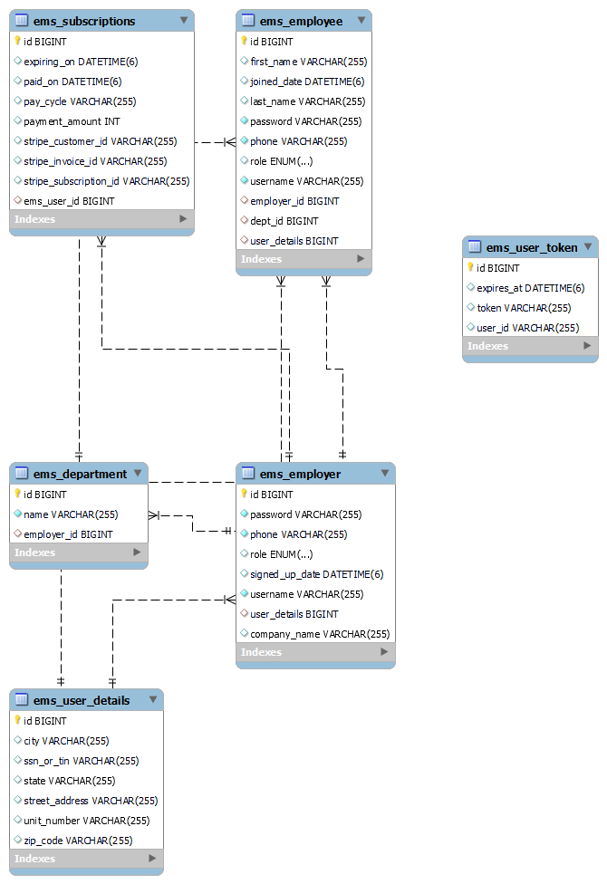

## Employee Management SAAS Application
User can manage their employees, create schedules, create task board to track tasks.

## Features

- Purchase a plan that suits your need
- Add and manage your employees
- Create Schedules
- Create and track task board activities.
- Email notifications.

## Technical Specifications

- **Frontend**: HTML, CSS, JavaScript, Typescript, React.js, Redux.
- **JavaScript Libraries**: React, Redux, React Day Picker, Date Fns, Axios, React Router Dom
- **CSS Framework**: Tailwind CSS
- **Others**: LocalStorage, Css Grid, Css FlexBox.
  
- **Backend**: Microservice Architecture using Spring Boot
- **Technologies used**: Spring Cloud Api gateway, Service Discovery using Netflix Eureka, OpenFeing Client and Kafka for inter microservice communication, Spring Security, Lombok, Id Mask, JSON Web Tokens,
-  Email SMTP, Stripe Payment, Junit, Spring Data JPA.
-  **Services**: USER SERVICE, TASK SERVICE, NOTIFICATION SERVICE, SCHEDULE SERVICE.
-  **DATABASES**: MYSQL, MONGODB
  
## DATABASE ER DIAGRAM FOR USER SERVICE

