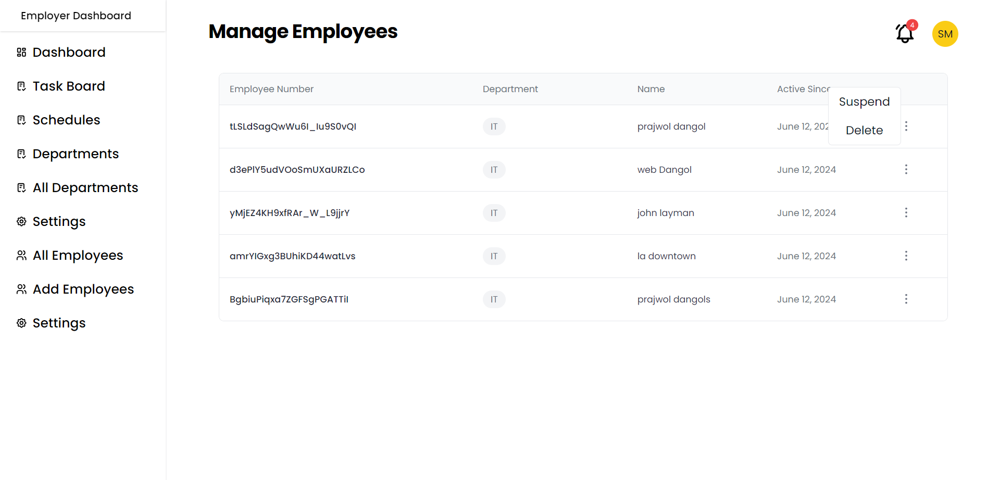

## Employee Management SAAS Application

User can manage their employees, create schedules, and create task boards to track tasks.

## Application Flow Architecture

## Features

- Register as an employer and Purchase a plan that suits your need
- Add and manage your employees
- Create Schedules
- Create and track task board activities.
- Email notifications.

## Features Coming Soon

- Employee Onboarding
- Employee Payroll Services
- Employee Inter Company Communication and Messaging Features.
- More Admin controls over employees.

## Technical Specifications

- **Frontend**: HTML, CSS, JavaScript, Typescript, React.js, Redux.
- **JavaScript Libraries**: React, Redux, React Day Picker, Date Fns, Axios, React Router Dom
- **CSS Framework**: Tailwind CSS
- **Others**: LocalStorage, Css Grid, Css FlexBox.
- **Backend**: Microservice Architecture using Spring Boot
- **Technologies used**: Spring Cloud Api gateway, Service Discovery using Netflix Eureka, OpenFeing Client and Kafka for inter microservice communication, Spring Security, Lombok, Id Mask, JSON Web Tokens,
- Email SMTP, Stripe Payment, Junit, Spring Data JPA.
- **Services**: USER SERVICE, TASK SERVICE, NOTIFICATION SERVICE, SCHEDULE SERVICE.
- **DATABASES**: MYSQL, MONGODB

## Current Endpoints

## USER SERVICE

Employer

- POST /user/employer/login
- POST /user/employer/register
- GET /user/employer/{id}
- PUT /user/employer/{empId}/password
- PUT /user/employer/{empId}
- PUT /user/employer/role/{empId}
- DELETE /user/employer/deleteEmployee/{empId}
- DELETE /user/employer/{empId}
- POST /user/employer/newEmployee
- POST /user/employer/generateToken/{empId}
- PUT /user/employer/updatePassword/{userId}

Employee

- POST /user/employee/login
- POST /user/employee/register
- GET /user/employee/{empId}
- PUT /user/employee/{id}
- PUT /user/employee/password/{empId}
- POST /user/employee/generateToken/{empId}
- PUT /user/employee/updatePassword/{userId}

Department

- GET /user/employer/departments
- GET /user/employer/departments/{id}
- POST /user/employer/departments
- PUT /user/employer/departments/{id}
- DELETE /user/employer/departments/{id}

## TASK SERVICE

- POST /task/board
- PUT /task/board/{taskId}
- DELETE /task/board/{taskId}
- GET /task/board
- GET /task/board/{taskId}
- GET /task/board/owner/{taskOwner}
- GET /task/board/department/{department}

## SCHEDULE SERVICE

- GET /schedule/timetable/{id}
- POST /schedule/timetable
- PUT /schedule/timetable/{id}
- DELETE /schedule/timetable/{id}
- GET /schedule/timetable
- GET /schedule/timetable/department/{departmentId}
- GET /schedule/timetable/employer/{employerId}
- GET /schedule/timetable/future
- GET /schedule/timetable/future/{employerId}

## DATABASE ER DIAGRAM FOR USER SERVICE

## Some Pages From Frontend

## Homepage

## Employer Dashboard

## Schedule Management

## Employee List Table

## Login Page for Employer Dashboard

## Register Page

## Task

